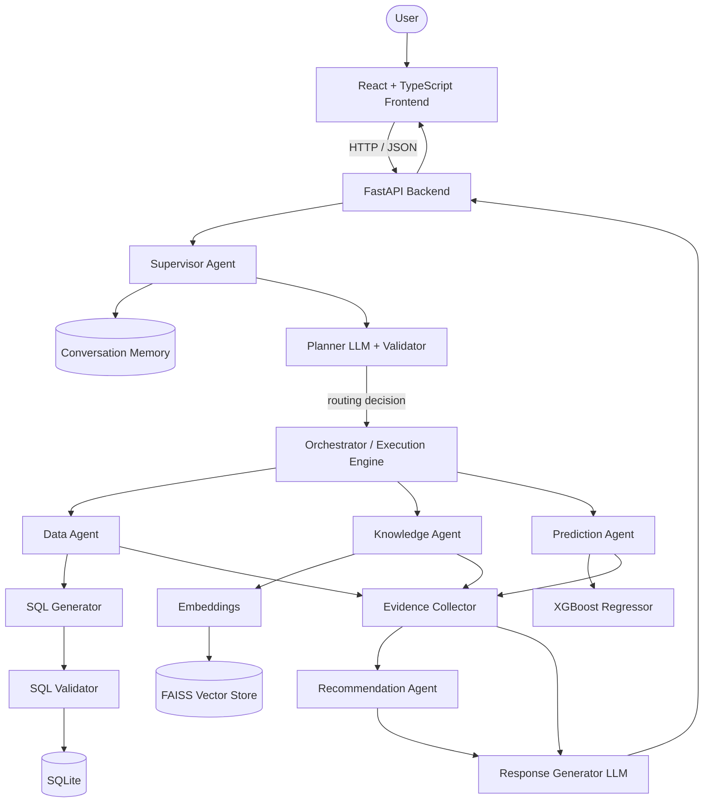
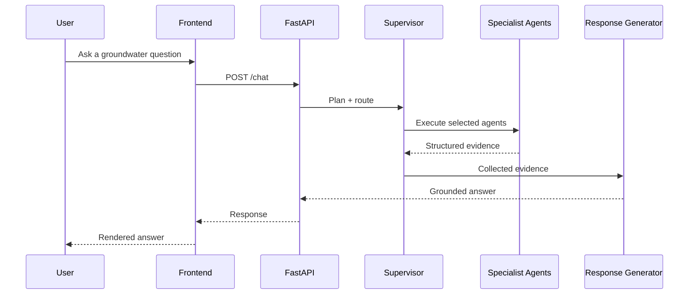

<div align="center">

# AquaMind AI

### Agentic RAG-Based Groundwater Intelligence & Decision Support System

Ask natural-language questions about Tamil Nadu groundwater and get **evidence-grounded** answers, drawn from official reports, structured datasets, and ML forecasts, orchestrated by a multi-agent AI pipeline.

<br/>


</div>

---

## Table of Contents

- [About](#about)
- [Features](#features)
- [Architecture](#architecture)
- [Tech Stack](#tech-stack)
- [Project Structure](#project-structure)
- [How It Works](#how-it-works)
- [Example Questions](#example-questions)
- [Screenshots](#screenshots)
- [Installation](#installation)
- [Environment Variables](#environment-variables)
- [Roadmap](#roadmap)
- [Design Principles](#design-principles)
- [License](#license)
- [Author](#author)

---

## About

Groundwater information for Tamil Nadu is scattered across hundreds of official PDF reports and multiple structured datasets, hard to search, harder to combine. **AquaMind AI** turns that fragmented knowledge into a single conversational interface.

Ask a question in plain English and the system decides *how* to answer it: query structured records with SQL, retrieve passages from official documents with semantic search, forecast future levels with a trained ML model, or combine all three, then return a single, grounded response.

The system answers groundwater questions using:

- **Official groundwater reports** (aquifer mapping, quality year books, resource assessments, recharge plans)
- **Structured groundwater datasets** (levels, rainfall, river discharge, district & firka assessments)
- **Agentic AI** for intent routing and orchestration
- **Retrieval-Augmented Generation (RAG)** over an embedded document corpus
- **Machine Learning** for groundwater-level forecasting
- **SQL-based structured reasoning** with validation before execution

Every answer is built from **retrieved evidence**, not from the language model's memory alone.

> **Scope:** the current release focuses on **Tamil Nadu** groundwater intelligence.

---

## Features

| | Capability | Description |
|---|---|---|
| 🧭 | **Agentic Architecture** | A Supervisor plans and routes; specialist agents each own a single responsibility. |
| 🧠 | **Supervisor Agent** | LLM planner + strict validator that classifies intent and selects agents (no direct answering). |
| 🗃️ | **Data Agent** | Natural language → validated SQLite `SELECT`, executed against a groundwater database. |
| 📚 | **Knowledge Agent** | RAG over official documents using semantic search. |
| 📈 | **Prediction Agent** | Groundwater-level forecasting via a trained regression model. |
| 💡 | **Recommendation Agent** | Evidence-based guidance, generated only when the question calls for it. |
| ✍️ | **Response Generator** | Produces the final grounded, explainable answer from collected evidence. |
| 🛡️ | **SQL Generation + Validation** | Intent-aware SQL with safety and minimality checks *before* execution. |
| 🔎 | **Semantic Retrieval** | FAISS vector store + Sentence-Transformer embeddings. |
| 🌐 | **FastAPI Backend** | Async API layer with centralized error handling and CORS. |
| 💻 | **React + TypeScript Frontend** | Modern chat UI built with Vite. |

---

## Architecture



### Components

| Component | Responsibility |
|---|---|
| **Frontend** | React + TypeScript chat interface (Vite build); renders Markdown responses and manages the conversation session. |
| **FastAPI Backend** | Thin integration layer: request validation, session cookies, CORS, error mapping, and a warm-started pipeline. |
| **Supervisor Agent** | Reads conversation memory, runs the Planner LLM, and validates a structured routing decision. It never answers directly. |
| **Orchestrator / Execution Engine** | Executes the selected specialist agents in order and isolates per-agent failures. |
| **Data Agent** | Converts the question into one minimal, validated SQLite `SELECT` and runs it against the groundwater database. |
| **Knowledge Agent** | Embeds the query, searches the FAISS index over official documents, and formats grounded passages. |
| **Prediction Agent** | Produces groundwater-level forecasts from a serialized ML model. |
| **Recommendation Agent** | Decides whether recommendations are warranted, then generates evidence-based guidance. |
| **Response Generator** | Synthesizes the final answer strictly from collected evidence. |

---

## Tech Stack

| Layer | Technologies |
|---|---|
| **Frontend** | React 18, TypeScript, Vite, React Router, Axios, react-markdown |
| **Backend** | FastAPI, Uvicorn, Pydantic, python-dotenv |
| **Language Models** | OpenCode Zen (DeepSeek V4 Flash) and Groq (Llama 3.3) via the OpenAI-compatible SDK |
| **Retrieval (RAG)** | FAISS (CPU), Sentence-Transformers |
| **Machine Learning** | XGBoost regressor inside a scikit-learn Pipeline (persisted with joblib) |
| **Structured Data** | SQLite, pandas, NumPy |
| **Tooling** | Python 3.11+, Node.js, Git & GitHub, Docker (backend) |

---

## Project Structure

Only the important directories are shown.

```text
AquaMind-AI/
├── agents/                         # The multi-agent AI pipeline
│   ├── supervisor_agent/           # Planner, orchestrator, conversation memory, routing rules
│   │   ├── planner/                # Planner LLM, models, validator, prompt builder
│   │   ├── orchestrator/           # Execution engine + request/response models
│   │   ├── memory/                 # Conversation memory
│   │   └── supervisor_llm_inputs/  # System prompt + routing rules
│   ├── data_agent/                 # Structured (SQL) reasoning
│   │   ├── llm/                    # SQL generator + intent validator + prompts/schema
│   │   ├── database/               # SQLite executor + groundwater database
│   │   └── formatter/              # Evidence formatter
│   ├── knowledge_agent/            # Retrieval-Augmented Generation
│   │   ├── ingestion/ preprocessing/ chunking/   # Document → chunks
│   │   ├── embedding/ vector_store/              # Embeddings → FAISS index
│   │   ├── retrieval/              # Query embedder + FAISS retriever + coordinator
│   │   └── formatter/              # Knowledge formatter
│   ├── prediction_agent/           # ML forecasting
│   │   ├── training/               # Feature engineering, dataset integration, training
│   │   ├── models/                 # Serialized model artifact
│   │   └── formatter/              # Prediction formatter
│   ├── recommendation_agent/       # Decision + recommendation generation
│   │   ├── decision/               # Whether a recommendation is needed
│   │   └── generator/              # Recommendation generator
│   └── response_generator/         # Final grounded response synthesis
├── backend/                        # FastAPI integration layer
│   ├── api/                        # Routes (chat, health) + request models
│   ├── services/                   # Pipeline service (wires the agents)
│   ├── middleware/                 # Exception handling + logging
│   ├── main.py                     # App entry point
│   └── Dockerfile
├── frontend/                       # React + TypeScript client
│   └── src/                        # components, pages, context, hooks, services, styles
├── pdf/                            # Official groundwater reports (source corpus)
├── structured_data/                # Structured groundwater datasets
├── requirements.txt                # Single-command Python install
└── README.md
```

---

## How It Works

1. **User asks a question** in the chat interface (e.g., *"What is the groundwater level in Salem?"*).
2. **Supervisor analyzes intent** using conversation memory and the Planner LLM.
3. **Planner routes** the request to the right specialist agent(s), with a validated decision. Non-groundwater questions are handled gracefully without running the pipeline.
4. **Agents retrieve information** — the Data Agent runs validated SQL, the Knowledge Agent performs semantic retrieval over documents.
5. **Prediction Agent forecasts** groundwater levels when the question is about the future.
6. **Recommendation Agent generates guidance** when recommendations are warranted.
7. **Response Generator** synthesizes the final, grounded answer from the collected evidence.
8. **Frontend displays** the response with formatting.



---

## Example Questions

```text
What is the groundwater level in Salem?
Predict groundwater level in Coimbatore for 2030.
What causes groundwater depletion?
Suggest recharge methods for Tirunelveli.
Compare groundwater level in Salem between 2023 and 2024.
```

| Question type | Agent(s) engaged |
|---|---|
| Measured / statistical values | Data Agent (SQL) |
| Concepts, causes, policies, methods | Knowledge Agent (RAG) |
| Future / forecast | Prediction Agent (ML) |
| "What should be done?" | Recommendation Agent |

---

## Screenshots

> Screenshots are placeholders. Add images under `docs/screenshots/` and they will render here.

| Landing Page | Chat Interface |
| :---: | :---: |
|  |  |

| Prediction | Recommendation |
| :---: | :---: |
|  |  |

---

## Installation

### Prerequisites

- Python **3.11+**
- Node.js **18+** and npm
- Git

### 1. Clone the repository

```bash
git clone https://github.com/Velayutham-S/aquamind-ai.git
cd aquamind-ai
```

### 2. Backend setup

```bash
# Create and activate a virtual environment
python -m venv .venv
# Windows
.venv\Scripts\activate
# macOS / Linux
source .venv/bin/activate

# Install all Python dependencies (backend + AI pipeline)
pip install -r requirements.txt
```

### 3. Frontend setup

```bash
cd frontend
npm install
cd ..
```

### 4. Configure environment variables

See [Environment Variables](#environment-variables) below.

### 5. Run the backend

```bash
uvicorn backend.main:app --host 0.0.0.0 --port 8000 --reload
```

### 6. Run the frontend

```bash
cd frontend
npm run dev
```

The frontend runs on `http://localhost:5173` and talks to the backend on `http://localhost:8000`.

---

## Environment Variables

Two configuration files are used. **Use placeholders only, never commit real secrets** (both are covered by `.gitignore`).

<details>
<summary><strong>backend/.env</strong> — backend server settings</summary>

```env
HOST=0.0.0.0
PORT=8000
LOG_LEVEL=INFO
CORS_ORIGINS=http://localhost:5173,http://127.0.0.1:5173
SESSION_COOKIE_NAME=aquamind_session
WARMUP_ON_STARTUP=true
```

</details>

<details>
<summary><strong>.env.testing</strong> — LLM provider API keys (read by the AI pipeline)</summary>

```env
# Each agent uses its own dedicated key (OpenAI-compatible providers).
PLANNER_TESTING_API_KEY=your_api_key_here
SQL_GENERATOR_TESTING_API_KEY=your_api_key_here
RECOMMENDATION_DECISION_TESTING_API_KEY=your_api_key_here
RECOMMENDATION_GENERATOR_TESTING_API_KEY=your_api_key_here
RESPONSE_GENERATOR_TESTING_API_KEY=your_api_key_here

# Per-provider rate-limit cap
REQUESTS_PER_MINUTE=15
```

</details>

---

## Roadmap

**Implemented**

- [x] Agentic pipeline with Supervisor planning + orchestration
- [x] Data Agent with SQL generation, validation, and execution
- [x] Knowledge Agent with FAISS + Sentence-Transformer RAG
- [x] Prediction Agent (ML forecasting)
- [x] Recommendation Agent and grounded Response Generator
- [x] FastAPI backend + React/TypeScript frontend
- [x] Graceful out-of-domain handling

**Planned**

- [ ] Voice assistant
- [ ] GIS / map-based visualization
- [ ] Real-time data ingestion
- [ ] Multi-state support (beyond Tamil Nadu)
- [ ] Mobile app

---

## Design Principles

AquaMind AI is built as a **production-style**, not a prototype, codebase:

- **Modular** — every agent has a single responsibility and a clear interface.
- **Deterministic where possible** — SQL generation, validation, and routing are validated with explicit rules; LLMs are used only where reasoning is genuinely required.
- **Evidence-grounded** — the final answer is synthesized from retrieved evidence, reducing hallucination.
- **Resilient** — per-agent failures are isolated, and terminal data failures stop the pipeline before answer generation rather than producing a broken response.
- **Scalable & maintainable** — clean separation between the AI pipeline, the API layer, and the UI, so components can evolve independently.

---


---


[](https://www.linkedin.com/in/velayutham-ai/)
[](https://github.com/Velayutham-S)

<div align="center">

If this project helped or impressed you, consider giving it a ⭐

</div>
